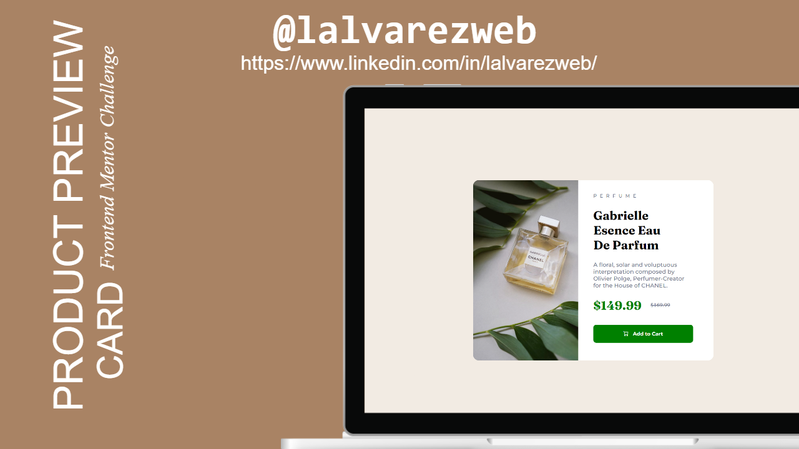

# Frontend Mentor - Product Preview Card solution

This is a solution to the [Product Preview Card challenge on Frontend Mentor](https://www.frontendmentor.io/challenges/product-preview-card-component-GO7UmttRfa/hub). Frontend Mentor challenges help you improve your coding skills by building realistic projects. 

## Table of contents

- [Overview](#overview)
  - [Screenshot](#screenshot)
  - [Links](#links)
- [My process](#my-process)
  - [Built with](#built-with)
  - [What I learned](#what-i-learned)
- [Author](#author)

## Overview

### Screenshot

### Links

- Solution URL: [Solution URL](https://github.com/ITLUCDEV/frontend-mentor-challenges/tree/master/product-preview-card)
- Live Site URL: [Live Site](https://itlucdev.github.io/qrcode.com)

## My process

### Built with

- Semantic HTML5 markup
- CSS custom properties
- Flexbox
- CSS Grid

### What I learned

I have improved my CSS knowledge by putting into practice what I have learned in the last courses I have been taking, going from theory to practice, I have learned how to manage margins, paddings and flexbox.

## Author

- Linkedin - [Luis Álvarez Corral](https://www.linkedin.com/in/lalvarezweb/)
- Frontend Mentor - [@ITLUCDEV](https://www.frontendmentor.io/profile/ITLUCDEV)

